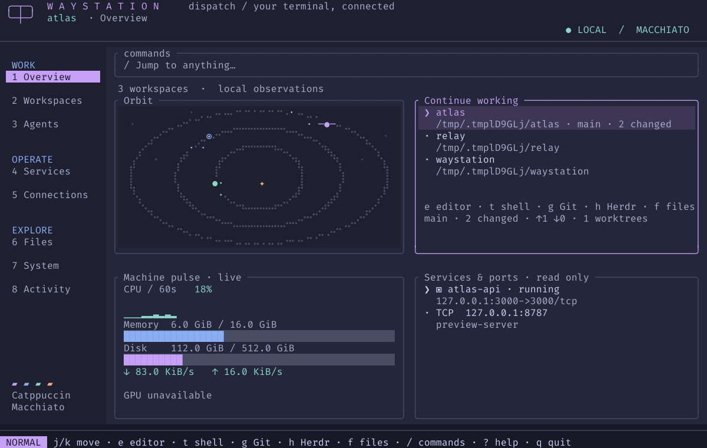

<p align="center">
  
</p>

<h1 align="center">Waystation</h1>

<p align="center">A home base for the work happening in your terminal.</p>

Waystation brings project workspaces, persistent AI agent sessions, system
status, services, and SSH tunnels into one keyboard-driven Linux dashboard.
The overview has a little orbiting solar system, too.



*The real Waystation interface, rendered with illustrative project and service
data. The planets move when the app is running.*

## What you can do

- **Pick up where you left off.** Discover projects, see Git context, and open
  an editor, shell, Git UI, or file browser from the selected workspace.
- **Keep agents close.** Create named Codex or Claude sessions, switch away with
  F12 (or Ctrl-\ on keyboards without function keys), and return without losing
  their terminal output.
- **Watch your plan limits.** See how much of Claude's and Codex's 5-hour and
  weekly limits you have left, when they reset, and how many tokens you've
  spent in the last 5 hours, today, and this week.
- **See your machine at a glance.** Check CPU, memory, disk, network, Docker
  containers, and listening ports without leaving the dashboard.
- **Open connections on demand.** Start configured SSH tunnels, inspect their
  logs, and stop them with confirmation.

Waystation does not start agents, tunnels, or external tools on launch. Missing
integrations show as unavailable without blocking the dashboard.

## Install and run

You need Linux, a UTF-8 terminal, and a Rust toolchain that supports edition
2024. Install the current source from GitHub:

```sh
cargo install --git https://github.com/kekn521/Waystation.git --locked
waystation
```

Or build a local checkout:

```sh
git clone https://github.com/kekn521/Waystation.git
cd Waystation
cargo install --path . --locked
waystation
```

No configuration file is required. If `~/code` exists, Waystation scans it for
projects; if `~/dotfiles` exists, it appears as a pinned workspace. Agent
sessions require `tmux`; other optional tools are described below.

## Find your way around

| Key | Action |
| --- | --- |
| `1`–`8` | Overview, Workspaces, Agents, Services, Connections, Files, System, Activity |
| `/` | Search projects, sessions, and available actions |
| `j` / `k` or arrows | Move through items |
| `Tab` | Switch the focused overview pane |
| `Enter` | Open the selected item |
| `e` / `t` / `g` / `h` / `f` | Editor, shell, Git UI, Herdr, or files for the workspace |
| `n` | Create a session in Agents |
| `F12` or `Ctrl-\` | Return to Waystation from an agent session |
| `?` | Show all shortcuts |
| `q` | Quit |

The overview shows orbiting planets, workspaces, machine status, and services
in four panes. On smaller terminals it shows the focused pane; use `Tab` to
move between them.

### Agent sessions

Press `3`, then `n` to name a Codex or Claude session and choose its project.
`Ctrl+S` creates and opens it. `F12` or `Ctrl-\` returns to Waystation; `Enter` opens the
session again. Waystation uses its own private `tmux` server, separate from
your regular sessions. Agents survive Waystation exiting and restarting.
After a computer reboot, Claude and Codex sessions show as "saved"; press
`Enter` to start the agent again in the same project and resume its
conversation. The earlier terminal scrollback is not restored. Waystation
still never starts them on its own; it only resumes one when you open it.
Closing a session with `x` ends its process and scrollback after
confirmation; the Claude or Codex conversation history itself stays in place.

Waystation follows the conversation an agent is actually in, including after
`/clear` in Claude or `/new` in Codex, using the agent's SessionStart hook.
Claude needs no setup: Waystation passes the hook with `--settings` each time
it launches Claude, and your `~/.claude/settings.json` is left alone. Codex
gets the hook with `-c` each time Waystation launches it, so your
`~/.codex/hooks.json` is left alone too; Codex asks you to trust the hook the
first time. Because of the `-c` override, Waystation's Codex sessions run
embedded rather than through Codex's shared background server, and Codex
notes this with a startup warning; that is what lets the hook reach
Waystation. The hook does nothing outside sessions Waystation started.

### Usage

The Agents view (`3`) shows a usage panel above your sessions, and the
Overview's Machine pulse pane adds a one-line summary. Codex's limits come
from the session files Codex already writes, so they appear after Codex's
next reply.

Claude only shares its limits with a status line command. The Agents view
offers "Show Claude's plan limits in Waystation"; confirming sets `statusLine`
in `~/.claude/settings.json` to Waystation's, which saves the limits and prints
nothing, so Claude Code still shows no status line. If you already have a
status line, Waystation leaves it alone.

Token counts cover fresh input and output; cache reads are left out because
they would dwarf everything else. Everything is read from local files;
Waystation makes no network requests for this.

### SSH tunnels

Add a tunnel in your configuration, then start it from Connections (`5`) or
search. Waystation shows its logs and offers a confirmed stop action. It never
connects to an SSH host just because you launched the dashboard.

## Make it yours

Create `~/.config/waystation/config.toml` only if you want to change the
defaults. For example:

```toml
project_roots = ["~/code", "~/projects"]
pinned_projects = ["~/code/my-app"]

[theme]
accent = "mauve" # or "blue"
compact = false
```

See [config.example.toml](config.example.toml) for editor, tool, and SSH tunnel
settings. `~/` expands to your home directory; relative paths are resolved
from the config file's directory.

| Data | Default path | Override |
| --- | --- | --- |
| Config | `~/.config/waystation/config.toml` | `--config PATH` or `$XDG_CONFIG_HOME` |
| State and logs | `~/.local/state/waystation` | `--state-dir PATH` or `$XDG_STATE_HOME` |

If you used the earlier app named Station, Waystation keeps using an existing
`station` config file or state directory until the corresponding `waystation`
path exists. It does not move or delete your saved data.

## Optional tools

Waystation uses programs already installed on your machine:

- `tmux` plus `codex` or `claude` for persistent agent sessions.
- `ssh` for configured tunnels.
- `git` and optionally `lazygit` for workspace context and Git actions.
- An editor such as `hx`, `nvim`, `vim`, or `vi`; set `[editor]` to choose one.
- `docker`, `ss`, and optionally `nvidia-smi` for service, port, and GPU details.
- `herdr`, `htop`, and `wl-copy` or `xclip` for their corresponding actions.

Missing tools show an unavailable message instead of blocking the dashboard.
The system view reads baseline CPU, memory, and network data from `/proc`.

## Develop and verify

```sh
cargo fmt --check
cargo clippy --all-targets -- -D warnings
cargo test --all-targets
cargo build --release --locked
python3 scripts/pty-check.py target/release/waystation
python3 scripts/workflow-pty.py target/release/waystation
```

The terminal checks use temporary local stand-ins; they do not contact a real
SSH host or AI provider. To regenerate the illustrative overview as SVG:

```sh
cargo run --example capture -- /tmp/waystation-overview.svg 120 38 overview-demo
```

Waystation is built with [Ratatui](https://ratatui.rs/) and uses the
Catppuccin Macchiato palette. Earlier
release checks and implementation notes are in [docs/verification.md](docs/verification.md).
